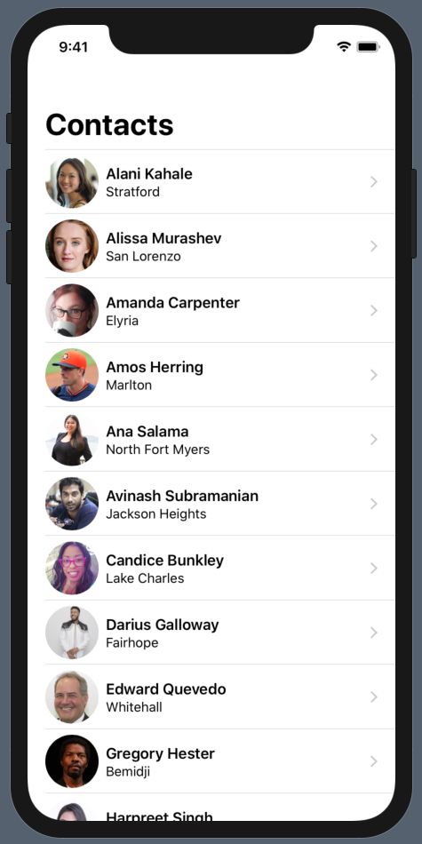
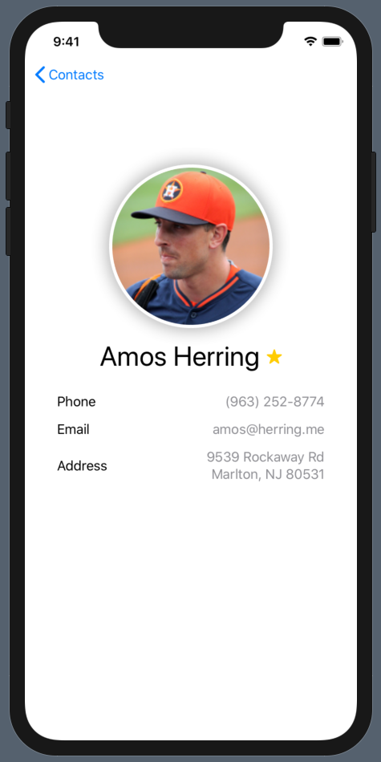
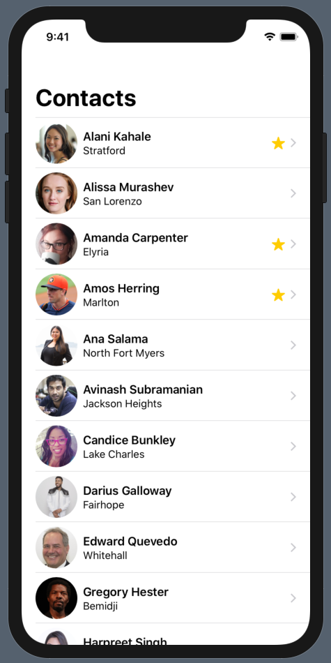

# Contacts-SwiftUI

  
  
  

## Overview

Contacts-SwiftUI is a contacts app built using SwiftUI! Scroll through a dynamic list of contacts, bring up detail views with contact info, and mark contacts as favorites! The app incorporates:

- SwiftUI
- Bindable Objects
- Navigation Views and Buttons
- Lists and Stacks
- Images and Text
- Plists

## Custom Features

Additional features were added to the original functionality of the app, including:

- Dynamic UI using SwiftUI
- Circular Contact Photos with Shadow

## Getting Started

> This app is not available on the App Store.

### Prerequisites

- A Mac running macOS Catalina (beta)
- Xcode 11 (beta)

### Installation

1. Clone or download the project to your local machine
2. Open the project in Xcode
3. Run the simulator

## Acknowledgements

The following resources were used in the development of this project. All custom code is my own.

- [Introduction to Table Views](https://teamtreehouse.com/library/introduction-to-table-views)
- [SwiftUI Essentials: Handling User Input](https://developer.apple.com/tutorials/swiftui/handling-user-input)

Interested in learning more about iOS Development? [Sign up today](http://referrals.trhou.se/bobbyconti1)!
